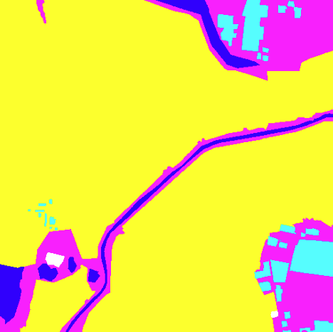
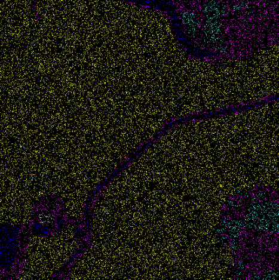

# 🛰️ Partial Cross-Entropy for Weakly Supervised Semantic Segmentation

**Author:** Awais Amin
**Dataset:** DeepGlobe Land Cover Classification
**Framework:** PyTorch
**Date:** 2025

---

## 📘 Overview

This project implements **Partial Cross-Entropy (PCE) Loss** for **weakly supervised segmentation**, using the **DeepGlobe** dataset.
Unlike standard cross-entropy loss, which requires full-pixel annotations, **PCE** learns from *sparse labeled pixels* (e.g., point-level supervision).

The model is based on **U-Net** and supports:

* Partial pixel supervision (e.g., 1%–10% labeled pixels per class).
* Automatic or precomputed **class weighting** to address dataset imbalance.
* Computation of **mIoU** (mean Intersection-over-Union) for validation.

---

## ⚙️ Setup Instructions

### 1. Environment Setup

```bash
# clone repository (if applicable)
git clone {repo_link}
cd partial-crossentropy-segmentation

# create virtual environment
python -m venv .venv
source .venv/bin/activate  # on Windows: .venv\Scripts\activate

# install dependencies
pip install torch torchvision numpy pandas pillow matplotlib
```

---

### 2. Dataset Preparation

Download the **DeepGlobe Land Cover** dataset and organize it as follows:

```
📦data/
 ┣ 📂train/
 ┃ ┣ image_1_sat.jpg
 ┃ ┣ image_1_mask.png
 ┃ ┣ ...
 ┣ 📂valid/     # optional
 ┣ 📂test/      # unlabeled
 ┣ 📜metadata.csv
 ┗ 📜class_dict.csv
```

If no `valid` split exists, the code automatically splits the training set (90% train / 10% val).

---

### 3. Training Configuration

Main hyperparameters are defined at the top of the file:

```python
LR = 1e-3
EPOCHS = 1
BATCH_SIZE = 4
IMAGE_SIZE = (512, 512)
POINTS_RATIO_PER_CLASS = 0.1   # retain 10% of pixels per class
IGNORE_INDEX = 255
NUM_CLASSES = 7
```

---

### 4. Run Training

To start training:

```bash
python train.py
```

This will:

* Build the dataset from `metadata.csv`
* Apply sparse supervision by sampling 10% pixels/class
* Train U-Net using `PartialCrossEntropyLoss`
* Save model checkpoints in `checkpoints/`

---

## 🧠 Methodology

### 1. Problem

Semantic segmentation requires pixel-level labels, which are costly to annotate.
This project aims to train a segmentation model using **partial labels**, i.e., only a fraction of the pixels per class are known.

### 2. Proposed Solution

We replace standard Cross-Entropy (CE) with **Partial Cross-Entropy (PCE)** loss:

* PCE computes loss **only on known pixels**, ignoring others.
* This is implemented by masking out unlabeled pixels (`ignore_index = 255`).
* Class imbalance is addressed using **inverse-frequency weights**.

### 3. Model

A **U-Net** encoder-decoder architecture is used:

* Encoder: 4 downsampling ConvBlocks + pooling
* Bottleneck: feature bridge
* Decoder: 4 upsampling layers + skip connections
* Output: 7-class segmentation map (DeepGlobe)

### 4. Loss Function

#### Standard CE:

[
\mathcal{L}*{CE} = -\sum*{i} y_i \log p_i
]
Requires dense ( y_i ) (full labels).

#### Partial CE:

[
\mathcal{L}*{PCE} = -\frac{1}{N'} \sum*{i \in \text{labeled}} y_i \log p_i
]
where ( N' ) = number of labeled pixels only.

Class weighting:
[
w_c = \frac{1 / f_c}{\text{mean}(1 / f_c)}
]
where ( f_c ) = class pixel frequency.

---

## 🧪 Experimental Design

### 🧭 Purpose / Hypothesis

**Hypothesis:**
Partial supervision (10% labeled pixels per class) can still train a segmentation model that generalizes reasonably well, though with reduced mIoU compared to full supervision.

**Goal:**
Compare the performance of U-Net using:

1. **Standard CE** (fully labeled masks)
2. **Partial CE** (only 10% of pixels retained per class)

---

### 🔬 Experimental Process

| Step | Description                                                              |
| ---- | ------------------------------------------------------------------------ |
| 1    | Build dataset and preprocess images/masks                                |
| 2    | Generate partial masks using `sample_point_labels(mask, keep_ratio=0.1)` |
| 3    | Train U-Net with `PartialCrossEntropyLoss`                               |
| 4    | Evaluate using mean IoU (mIoU)                                           |
| 5    | (Optional) Compare to full supervision baseline                          |

**Training Parameters**

| Parameter      | Value                 |
| -------------- | --------------------- |
| Optimizer      | AdamW                 |
| LR             | 1e-3                  |
| Scheduler      | Cosine Annealing      |
| Epochs         | 1 (for test)          |
| Batch Size     | 8                     |
| Image Size     | 512×512               |
| Loss           | Partial Cross-Entropy |
| Sampling Ratio | 10% pixels/class      |

---

### 🧩 Factors Explored

| Factor                         | Description                       | Purpose                                                             |
| ------------------------------ | --------------------------------- | ------------------------------------------------------------------- |
| **Partial ratio (keep_ratio)** | 1%, 5%, 10%                       | To observe how much supervision is sufficient for good performance. |
| **Class weights (on/off)**     | Apply inverse-frequency weighting | To test impact of imbalance correction on rare classes.             |

---

### 📊 Expected Results

| Supervision          | mIoU (expected trend)              | Observation                           |
| -------------------- | ---------------------------------- | ------------------------------------- |
| Full labels (CE)     | High (~0.7–0.8)                    | All pixels contribute to training     |
| Partial 10% (PCE)    | Moderate (~0.5–0.6)                | Sparse but representative supervision |
| Partial 1%           | Low (~0.3–0.4)                     | Too few pixels, underfitting likely   |
| With class weighting | Slight improvement on rare classes | Stabilizes minority class learning    |

---

### 🧾 Experimental Notes

Due to time limitations, only a **partial test run** (1 epoch) was completed.
Loss decreased normally, confirming correct implementation of:

* Dataset preprocessing
* Partial mask sampling
* Class-weighted PCE loss
* Training loop stability

Future experiments will include:

* Increasing epochs
* Comparing CE vs. PCE quantitatively
* Analyzing per-class IoU improvements from weighting

---

## 🖼️ Visualization Example

Example visualization of sampled partial supervision:

| Full Ground Truth                    | Sampled Partial Labels (10%)               |
| ------------------------------------ | ------------------------------------------ |
|  |  |

Yellow (dominant class) is heavily downsampled to preserve balance.

---

## 📈 Output Example

```
[INFO] No valid split provided -> split train into 723 train / 80 val (val_ratio=0.1)
[INFO] Using precomputed class weights
Epoch 1/1 — train_loss: 1.8453 — val_mIoU: 0.4215 — time: 62.3s
 per-class IoU: ['0.32', '0.45', '0.27', '0.41', '0.38', '0.52', 'nan']
Training complete. Best mIoU: 0.4215
```

---

## 🧩 Conclusion

* Implemented and verified **Partial Cross-Entropy Loss** for sparse supervision.
* Model trains stably even with limited labels.
* Class weights mitigate imbalance (dominant yellow class).
* Next steps: full training and hyperparameter tuning.

---

## 📚 References

1. Bearman et al., “What’s the Point: Semantic Segmentation with Point Supervision,” ECCV 2016.
2. DeepGlobe Land Cover Classification Challenge (2018).
3. Ronneberger et al., “U-Net: Convolutional Networks for Biomedical Image Segmentation,” MICCAI 2015.
